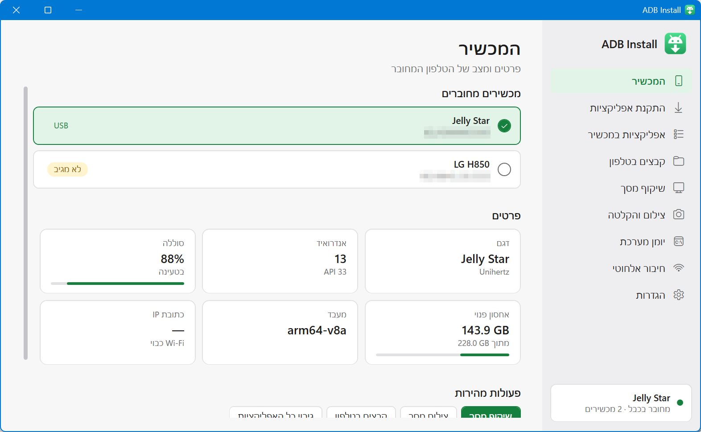
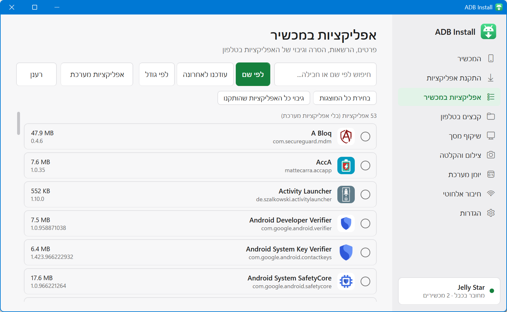
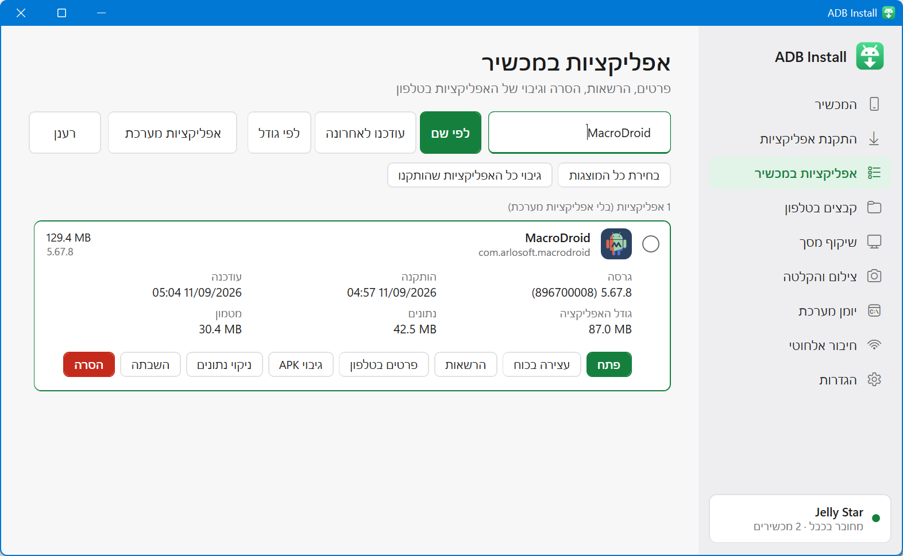
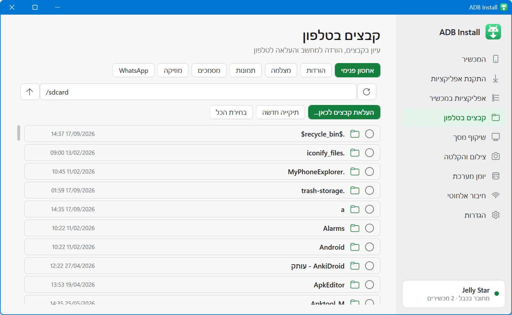
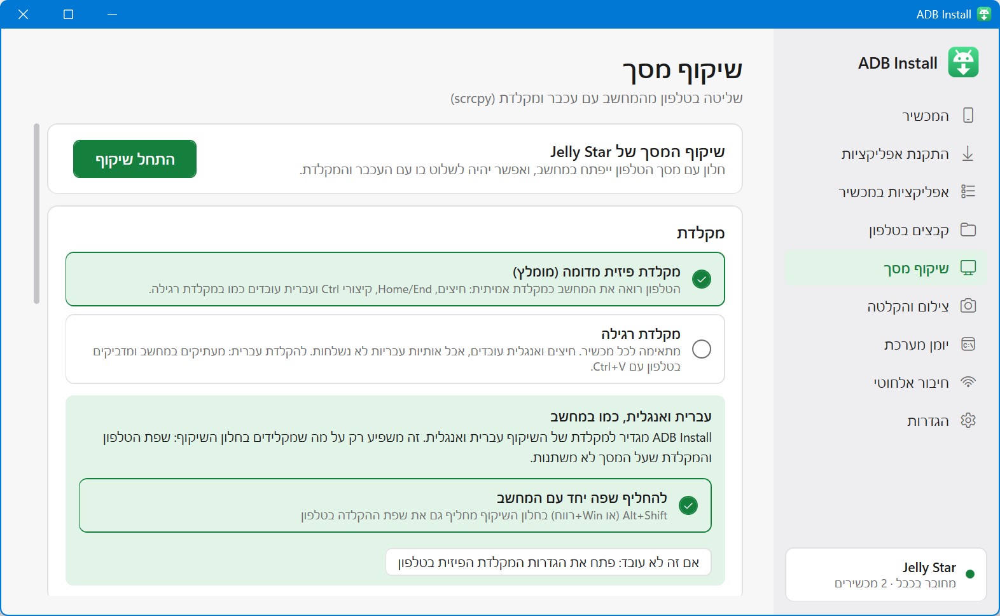
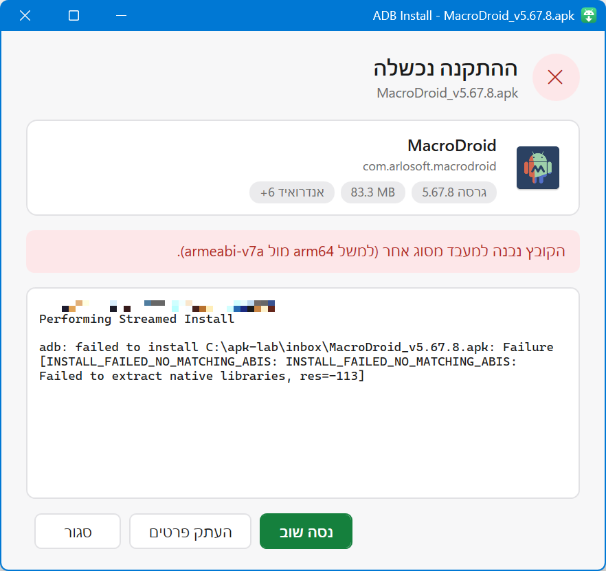
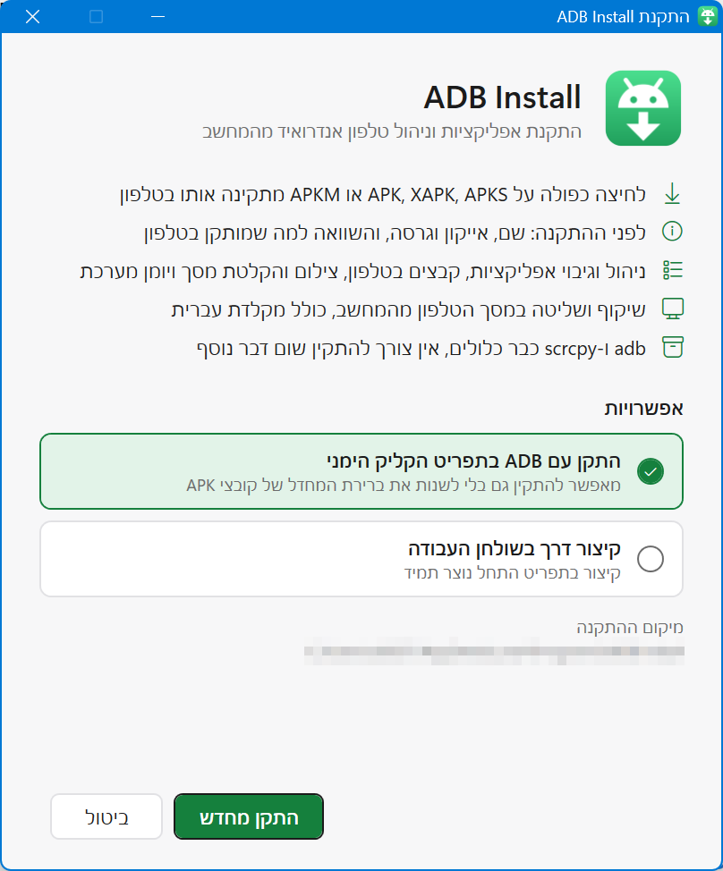

# ADB Install

התקנת קובצי APK לטלפון אנדרואיד בלחיצה כפולה, וניהול הטלפון מהמחשב. תוכנה ל-Windows עם ממשק בעברית.

*Install Android APKs with a double-click and manage your phone from Windows. Hebrew UI.*



## צילומי מסך

| | |
|---|---|
|  |  |
| **אפליקציות במכשיר:** שם ואייקון אמיתיים, גודל וגרסה | **פרטי אפליקציה:** תאריכים, נתונים, הרשאות וגיבוי |
|  |  |
| **קבצים בטלפון:** הורדה, העלאה ומחיקה | **שיקוף מסך:** עברית ואנגלית מתחלפות יחד עם המחשב |
|  |  |
| **התקנה בלחיצה כפולה:** פרטי האפליקציה והסבר בעברית כשמשהו נכשל | **תוכנת ההתקנה:** בלי הרשאות מנהל |

## מה אפשר לעשות

**התקנת אפליקציות**
- לחיצה כפולה על קובץ `.apk`, `.xapk`, `.apks` או `.apkm` מתקינה אותו בטלפון המחובר (כולל קובצי OBB).
- לפני ההתקנה מוצגים שם, אייקון, גרסה וגודל, והשוואה לגרסה שכבר מותקנת בטלפון.
- כמה מכשירים מחוברים? בוחרים באיזה להתקין, או בכולם.
- הסבר ברור בעברית כשההתקנה נכשלת, והצעה להסיר ולהתקין מחדש כשהחתימה שונה.

**ניהול הטלפון** (מתפריט התחל)
- **אפליקציות במכשיר:** שם ואייקון אמיתיים, תאריכי התקנה ועדכון, גודל האפליקציה והנתונים, הרשאות, השבתה, הסרה וגיבוי APK (גם של כמה אפליקציות יחד).
- **קבצים בטלפון:** עיון בתיקיות, הורדה למחשב, העלאה בגרירה, מחיקה ויצירת תיקיות.
- **שיקוף מסך** (scrcpy): שליטה בטלפון עם עכבר ומקלדת. שפת ההקלדה בטלפון מתחלפת יחד עם המחשב (Alt+Shift), בלי לשנות את שפת הטלפון.
- **צילום והקלטת מסך**, **יומן מערכת** (logcat) עם סינון לפי אפליקציה, **חיבור אלחוטי** ו**פרטי המכשיר**.

## התקנה

מורידים את `ADB-Install-Setup.exe` מעמוד ה-[Releases](../../releases) ומריצים.
- לא נדרשות הרשאות מנהל. התוכנה מותקנת למשתמש הנוכחי בלבד.
- adb ו-scrcpy כלולים, אין צורך להתקין שום דבר נוסף.
- הקובץ לא חתום דיגיטלית, ולכן Windows עשוי להציג אזהרת SmartScreen: "מידע נוסף" ← "הפעל בכל זאת".
- הסרה: הגדרות Windows ← אפליקציות ← ADB Install.

**דרישות:** Windows 10 או 11. בטלפון צריך להפעיל "ניפוי באגים ב-USB" באפשרויות המפתחים.

## בנייה מהקוד

```powershell
powershell -ExecutionPolicy Bypass -File build.ps1
```

הבנייה משתמשת רק במהדר C# שמגיע עם Windows (‏.NET Framework 4.8), והתוצאה נוצרת ב-`dist\ADB-Install-Setup.exe`.

הרכיב שרץ על הטלפון (`helper/Helper.java`) כבר בנוי ב-`assets/helper.dex`. כדי לבנות אותו מחדש צריך JDK ו-Android SDK (platform 34, build-tools 34):

```powershell
powershell -ExecutionPolicy Bypass -File helper\build-helper.ps1
```

מספר הגרסה נמצא ב-`src/AppInfo.cs`.

## מבנה הפרויקט

| תיקייה | תוכן |
|---|---|
| `src/` | קוד C# (WPF): חלון ההתקנה, החלון הראשי, קריאת APK, תוכנת ההתקנה |
| `helper/` | רכיב Java שרץ על הטלפון דרך `app_process`: שמות, אייקונים ופריסת מקלדת |
| `assets/` | אייקון, לוגו ו-`helper.dex` |
| `payload/` | adb ו-scrcpy שנארזים בתוך תוכנת ההתקנה |

## רישיונות של רכיבים כלולים

- **adb** מתוך Android SDK Platform Tools של Google. ראו `payload/NOTICE.txt`.
- **scrcpy** מאת Genymobile, ברישיון Apache 2.0. ראו `payload/scrcpy/LICENSE-scrcpy.txt`.
